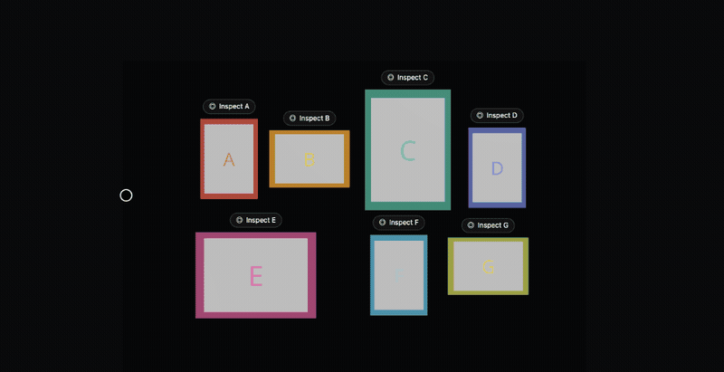

# poster-wall-controls

Custom React Three Fiber controls for a poster wall. Pan and zoom the wall, then click a poster to rotate it. This is not OrbitControls.

**[Live demo](https://mikespineu.github.io/poster-wall-controls/)** · **[npm](https://www.npmjs.com/package/poster-wall-controls)**



## Install

```bash
npm install poster-wall-controls @react-three/fiber @react-three/drei three react react-dom
npm install gsap
```

`gsap` is required for focus transitions. Deduplicate `three` in your bundler — a second copy breaks React Three Fiber.

## Quick start

1 world unit = 1 cm.

```tsx
import { Canvas } from '@react-three/fiber';
import { PosterWallControls, type PosterItem } from 'poster-wall-controls';

const items: PosterItem[] = [
  { id: 'a', x1: -16, x2: 16, y1: -22, y2: 22, z1: 0, z2: 1 },
];

function MyWall() {
  return (
    <Canvas camera={{ position: [0, 0, 200], fov: 45, near: 0.1, far: 5000 }}>
      <PosterWallControls items={items} fov={45} rotationLimitY={Infinity}>
        <PosterWallControls.Scene>
          <mesh>
            <boxGeometry args={[260, 180, 1]} />
            <meshStandardMaterial color="#1c1c20" />
          </mesh>
          {items.map((item) => (
            <PosterWallControls.Item key={item.id} item={item}>
              <mesh>
                <boxGeometry args={[item.x2 - item.x1, item.y2 - item.y1, item.z2 - item.z1]} />
                <meshStandardMaterial color="#e26d5c" />
              </mesh>
              <PosterWallControls.ItemLabel />
            </PosterWallControls.Item>
          ))}
        </PosterWallControls.Scene>
        <PosterWallControls.HUD />
      </PosterWallControls>
    </Canvas>
  );
}
```

## How to use it

**Group** — the whole wall. This is the default.

- Middle-click drag, right-click drag, or a two-finger drag pans the wall.
- Scroll wheel or pinch zooms.
- Vertical pan stays locked until you zoom in.
- Reset appears in the HUD after you move.

**Item** — one poster.

- Click a poster's label to focus it. The poster eases forward.
- Drag to rotate that poster. The camera stays put.
- Back leaves item focus.
- Click another label to switch posters without going back to the wall first.

## Try the example

```bash
npm install
npm run dev
```

Opens `http://localhost:5173` with a demo wall of seven posters.

## Reference

### Modes

| Mode  | Camera                                    | Gesture surface              |
|-------|-------------------------------------------|------------------------------|
| group | Looks at centroid of all items (default)  | pan + zoom over the wall     |
| item  | Locked to one poster's center             | rotate the poster mesh only  |

### Root props — `<PosterWallControls>`

| Prop                  | Default        | Notes                                          |
|-----------------------|----------------|------------------------------------------------|
| `items`               | —              | Required `PosterItem[]`.                       |
| `fov`                 | `45`           | Perspective FOV in degrees.                    |
| `minZoom` / `maxZoom` | auto           | Camera Z bounds for group mode.                |
| `zoomSpeed`           | `1`            | Wheel multiplier.                              |
| `marginTop/Right/Bottom/Left` | `0`    | cm of padding around the bbox. Negative values are allowed. |
| `rotationLimitY`      | `Infinity`     | Item-focus Y rotation cap (degrees).           |
| `rotationLimitX`      | `80`           | Item-focus X rotation cap (degrees).           |
| `rotationSensitivity` | `0.005`        | Radians per pixel.                             |
| `rotationClearance`   | `2`            | cm clearance used by auto `wallOffset`.        |
| `transitionDuration`  | `600`          | ms to enter item focus.                        |
| `transitionEase`      | `power2.inOut` | GSAP ease.                                     |
| `exitDuration` / `exitEase`   | same   | Leave item focus.                              |
| `resetDuration` / `resetEase` | same   | Return to the default group camera.            |

### `<PosterWallControls.Item>` props

| Prop          | Default | Notes                                            |
|---------------|---------|--------------------------------------------------|
| `item`        | —       | `PosterItem` whose runtime is registered.        |
| `wallOffset`  | auto    | cm the poster moves forward in item focus. Auto: `depth / 2 + rotationClearance`. |

### Poster sizes

| Name         | Width (cm) | Height (cm) |
|--------------|-----------|------------|
| M vertical   | 32        | 45         |
| M horizontal | 45        | 32         |
| L vertical   | 48        | 67.5       |
| L horizontal | 67.5      | 48         |

Use `vertical` / `horizontal`. Do not use `portrait` / `landscape`.

### Margins

```
              marginTop
       ┌───────────────────┐
       │ ┌───┐ ┌───┐ ┌───┐ │
marginLeft   posters     marginRight
       │ └───┘ └───┘ └───┘ │
       └───────────────────┘
              marginBottom
```

In group mode the camera Z is recomputed from the bounding box plus margins so the padded wall fits the viewport. Negative margins zoom in past the box edge.

### wallOffset

In item focus the poster moves forward on Z by `wallOffset`, so rotated corners do not clip the wall.

- Explicit: `<PosterWallControls.Item wallOffset={5}>` (cm)
- Auto: `posterDepth / 2 + rotationClearance` (`rotationClearance` defaults to 2)

On exit the mesh returns to its resting Z and rotation resets to `(0, 0, 0)`.

### Pan limits

Pan is clamped so the view always overlaps the combined bounding box of all items. At least one poster stays partly visible.

At the default zoom (camera Z within 0.5 of the fitted distance), vertical pan is ignored so a page can still scroll. Zoom in and vertical pan unlocks.

### Switching posters

Click another poster's label while one is already focused. One GSAP timeline:

1. Current poster rotation returns to `(0, 0, 0)`.
2. Current poster Z returns to its resting Z.
3. Camera moves to the new poster center (overlaps step 2).
4. New poster Z moves to resting Z plus `wallOffset`.

`focusedItemId` updates immediately. Back stays visible, mode stays `'item'`, and clicks are blocked until the timeline finishes.

### Why these controls are custom

Group mode is a flat pan and zoom along Z, not an orbit around a target. Vertical pan locks at the default zoom. Item focus rotates the mesh, not the camera. Touch has to mean pan, pinch, or rotate depending on the mode. OrbitControls cannot express that, so input is handled with pointer events and `useFrame`.

### Compound components

`<PosterWallControls>` keeps state in one React context. `Scene`, `Item`, `ItemLabel`, and `HUD` read and write that context through `useControlsContext()`. They are static properties on the root, so you compose them as a tree instead of passing render props.

### GSAP

GSAP (`>= 3.12`) is an optional peer dependency, loaded on first use. Without it, transitions throw:

> `[PosterWallControls] GSAP peer dependency not found. Install gsap >= 3.12.`

Durations and eases are passed through to `gsap.to()` and timelines as given.

## Contributing

```bash
npm install
npm run dev        # example app
npm run typecheck  # tsc --noEmit
npm run build      # tsup ESM + CJS
```

Issues and PRs are welcome. New behaviour stays in the compound-component API and does not add a pre-built controls package.
